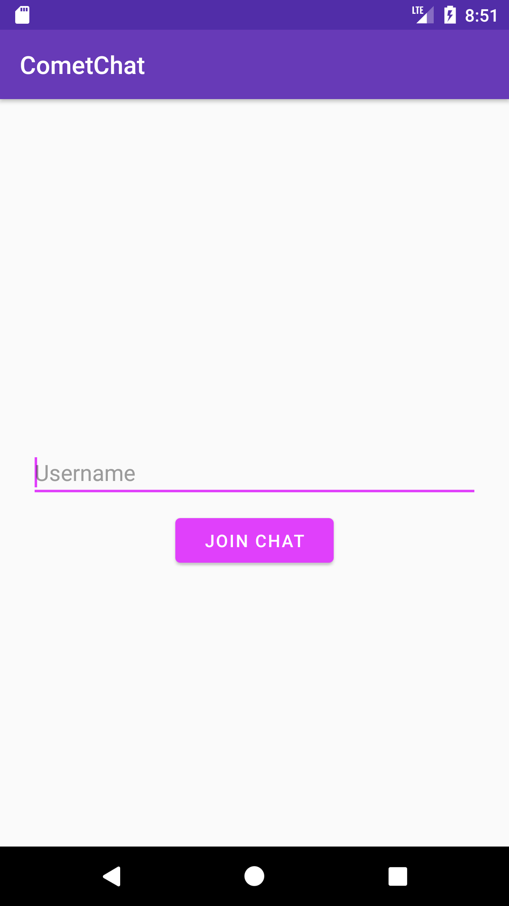
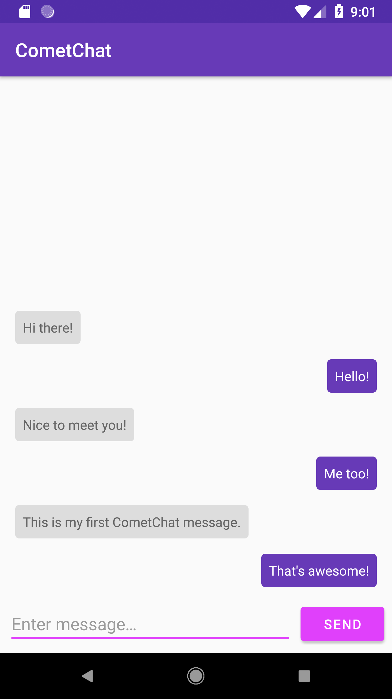

# Build a modern Android chat app with Kotlin

Read the full tutorial here:

[**>> Build a modern Android chat app with Kotlin**](https://paper.dropbox.com/doc/Build-a-modern-Android-chat-app-with-Kotlin--AXnKQvBG15aDT9uHJiOgeIblAg-RkqBGaoZOAfzHR1ARj3Hs)

This demo application shows how to build an Android group chat application with Kotlin:

 

## Running the demo

To run the demo follow these steps.

1. Create a CometChat account if you haven't already. [Create an account here](https://github.com/bookercodes/kotlin-group-chat/archive/master.zip).
2. From the [dashboard](https://app.cometchat.com/#/apps) create a new application then click **Explore**
3. Head to the **API Keys** tab on the left-hand-side then click **Create API Key** and create a **Full Access** key.
4. Download the repository [here](https://github.com/bookercodes/kotlin-group-chat/archive/master.zip) or by running `git clone https://github.com/arthlimchiu/CometChatPro-Tutorial.git` and open it in Android Studio
5. Update `res/values/strings.xml` with your own app ID and the API key you just created
6. Run the application in your emulator and login with one of the test users: superhero1, superhero2, superhero3, superhero4 or superhero5.\
7. Get chatty

## Useful links

- 🏠[Homepage](https://cometchat.com/pro)
- 🚀[Create your free account](https://app.cometchat.com/#/register)
- 📚[Documentation](https://prodocs.cometchat.com/docs)
- 👾[GitHub](https://github.com/CometChat-Pro)

## Related examples

* [Complete Kotlin team chat application with voice and video calling](https://github.com/cometchat-pro/android-kotlin-chat-app)

